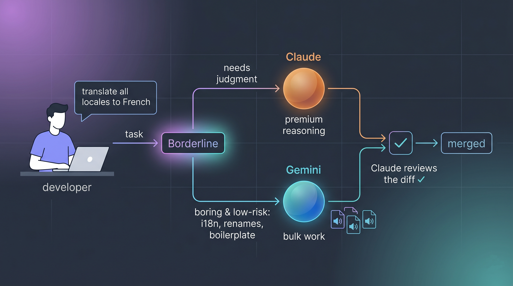

# Borderline

<p align="center">
  
</p>

A Claude Code plugin that **delegates to the Gemini CLI** (`gemini`) the boring,
mechanical, low-risk tasks where Gemini is just as reliable as Claude: bulk
translations and **i18n**, trivial style/color changes, repetitive renames and
replacements, boilerplate. The idea: a **transparent** Claude ⇄ Gemini pipeline, so
Claude stays reserved for what needs judgment.

## How it works

- **`borderline` skill** (`skills/borderline/SKILL.md`): the brain. It decides what is
  delegable, picks the mode, launches Gemini and **always reviews** the result. It
  auto-activates when it detects a borderline task.
- **`/borderline <task>` command**: explicit manual delegation.
- **`scripts/delegate.sh`**: a wrapper around `gemini` with two modes:
  - `--edit` → Gemini works autonomously in the repo (`gemini --yolo --skip-trust -p`),
    reading and writing files. For bulk work (mass i18n).
  - `--text` → Gemini only returns text (`gemini --approval-mode plan -p`), never
    touching files; Claude applies the result. For small changes.

Design decisions (set in this build):
- **Hybrid** by task: Gemini edits in bulk / returns text for small things.
- **Hybrid** activation: automatic (skill) + manual (`/borderline`).
- **Always review**: Claude verifies the diff before accepting anything.

## Requirements

- [Gemini CLI](https://geminicli.com) installed and on the `PATH` (`gemini --version`).
- Claude Code running with **`--dangerously-skip-permissions`**, so the pipeline is
  transparent and doesn't prompt for confirmation on every call.

## Installation

```bash
# In Claude Code:
/plugin marketplace add BansheeTech/Borderline
/plugin install borderline@borderline-marketplace
```

Then launch Claude with:

```bash
claude --dangerously-skip-permissions
```

## Usage

- **Automatic**: ask Claude for something borderline ("translate the locales to French",
  "switch the background to dark mode") and the skill will delegate to Gemini and report back.
- **Manual**: `/borderline translate locales/en.json to locales/de.json`.

## Structure

```
Borderline/
├── .claude-plugin/
│   ├── plugin.json          # plugin manifest
│   └── marketplace.json     # to install as a local marketplace
├── skills/borderline/SKILL.md
├── commands/borderline.md
├── scripts/delegate.sh
└── README.md
```
